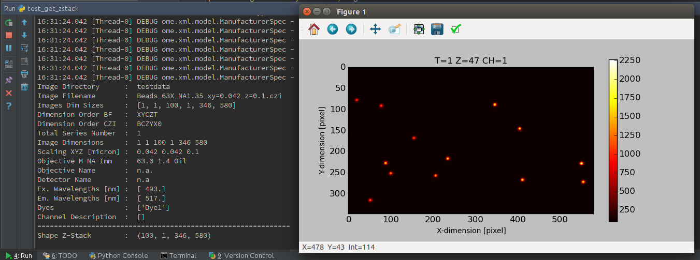
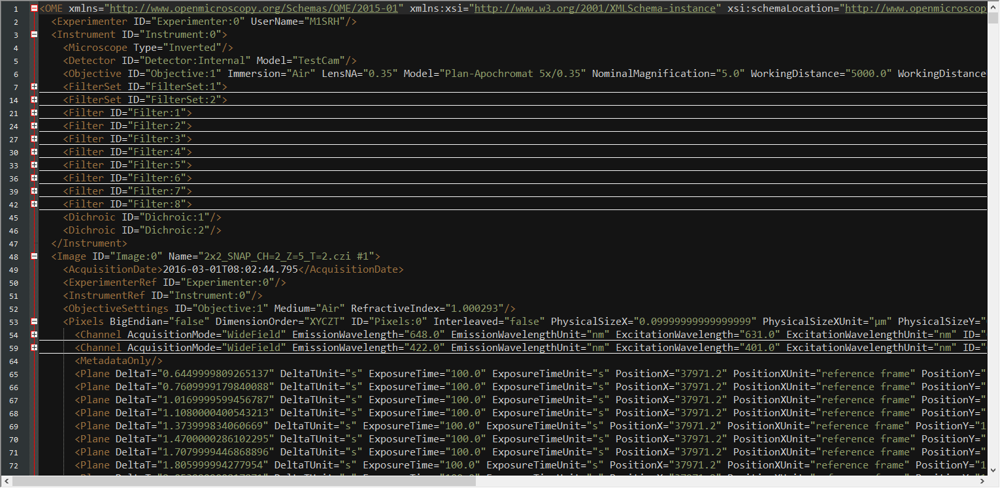
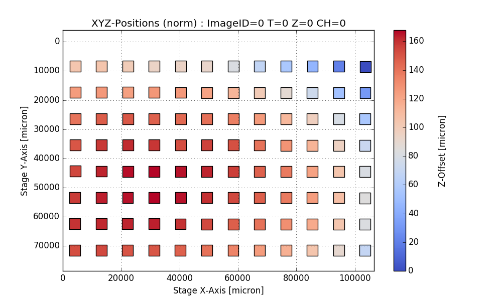

==================================
BioFormatsRead - Scripts and Tools
==================================

This collection of scripts can be used to read image data using BioFormats into numpy arrays.
It was initially created to simplify reading CZI image files, but should work with many more
image data files thanks to BioFormats.

The main scripts are:

*   bftools.py
*   czitools.py
*   misctools.py
*   czifile.py

:Author: Sebastian Rhode

:Version: 2017.05.02

Important Requirements
----------------------
* `Python 2 or 3 <http://www.python.org>`_
* `Numpy <http://www.numpy.org>`_
* `Matplotlib <http://www.matplotlib.org>`_
* `python-bioformats <https://github.com/CellProfiler/python-bioformats>`_
* `BioFormats package <http://downloads.openmicroscopy.org/bio-formats/>`_
* `javabridge <https://pypi.python.org/pypi/javabridge>`_
* `czifile <http://www.lfd.uci.edu/~gohlke/code/czifile.py.html>`_
* `tifffile <http://www.lfd.uci.edu/~gohlke/code/tifffile.py.html>`_

Notes
-----
The package is still under development and was mainly tested with CZI files.

The python-bioformats package includes loci_tool.jar but it is also possible to use the latest bioformats_package.jar.
Currently the 5.1.10 or the 5.4.1 version of bioformats_package.jar is used.

The new 5.4.1 version of the BioFormats library offers various new features for reading especially CZI images,
which are currently not fully supported by python-bioformats. But most of the functionality should work without any problems.

Some more information can be found at: `python-and-bioformats <http://slides.com/sebastianrhode/python-and-bioformats/fullscreen>`_

Important Remark: Not all function where tested to work with Python 3 yet.

Acknowledgements
----------------
*   Christoph Gohlke from providing the czifile.py and tifffile.py.
*   The Cellprofiler team for providing python-bioformats.
*   The OME people for creating BioFormats.

References
----------
(1)  CZI - Image format for microscopes
     http://www.zeiss.com/czi
(2)  The OME-TIFF format.
     http://www.openmicroscopy.org/site/support/file-formats/ome-tiff
(3)  Read microscopy images to numpy array with python-bioformats.
     http://ilovesymposia.com/2014/08/10/read-microscopy-images-to-numpy-arrays-with-python-bioformats/

Additional Tools
----------------
*   Read image series, z-stacks, time series or single planes.
*   Retrieve all important meta-information.
*   Write OME-XML Metadata to XML file.
*   Display XYZ data from PlaneTable.
*   Extract Well Information form Scenes (CZI only).

Screenshots
-----------

Disclaimer
----------
*   Remark: Please use at your own risk.
